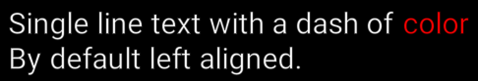
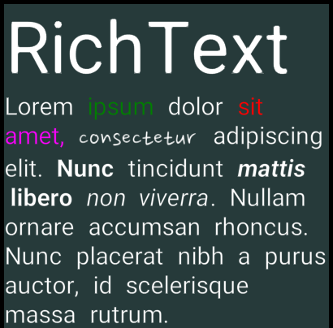

# Defold-RichText
Defold-RichText is a system to create styled text based on an HTML inspired markup language.

# Installation
You can use RichText in your own project by adding this project as a [Defold library dependency](http://www.defold.com/manuals/libraries/). Open your game.project file and in the dependencies field under project add:

https://github.com/britzl/defold-richtext/archive/master.zip

Or point to the ZIP file of a [specific release](https://github.com/britzl/defold-richtext/releases).

# Markup format
The markup format is HTML inspired, but not intended to be fully compatible with standard HTML. Just like in HTML the idea is that sections of text can be enclosed in matching start and end tags:

	This is a <b>bold</b> statement!

This is a <b>bold</b> statement!

## Nested elements
Nested elements are supported. Use this to give a section of text a combination of styles:

	This is a <b>bold <i>italic</i></b> statement!

This is a <b>bold <i>italic</i></b> statement!

### Important note about nested elements!
It is currently not possible to nest elements of the same tag. This means that the following will not work:

	This <color=green>will <color=red>not</color> work</color>

A workaround is to do like this instead:

	This <color=green>will</color> <color=red>not</color> <color=green>work</color>

## Supported tags
The following tags are supported:

| Tag   | Description                                    | Example                                     |
|-------|------------------------------------------------|---------------------------------------------|
| a     | Create a "hyperlink" that generates a message  | `<a=message_id>Foobar</a>`                  |
|       | when clicked (see `richtext.on_click`)         |                                             |
| b     | The text should be bold                        | `<b>Foobar</b>`                             |
| br    | Insert a line break (see notes on linebreak)   | ` `                                     |
| color | Change text color                              | `<color=red>Foobar</color>`                 |
|       |                                                | `<color=1.0,0,0,1.0>Foobar</color>`         |
|       |                                                | `<color=#ff0000>Foobar</color>`             |
|       |                                                | `<color=#ff0000ff>Foobar</color>`           |
| font  | Change font                                    | `<font=MyCoolFont>Foobar`            |
| i     | The text should be italic                      | `<i>Foobar</i>`                             |
| img   | Display image                                  | ``                      |
| nobr  | Prevent the text from breaking                 | `Words <nobr>inside tag</nobr> won't break` |
| size  | Change text size, relative to default size     | `<size=2>Twice as large</size>`             |
| spine | Display spine model                            | `<spine=scene:anim/>`                       |

### Line breaks
Note that there is no need for the HTML ` ` tag since line breaks (i.e. `\n`) are parsed and presented by the system. Note that a single ` ` (ie without a closing or empty tag) isn't supported (even though most browsers accept it).

### Named colors
The following named colors are supported:

| Name      | Hex value   | Swatch                            |
|-----------|:-----------:|:---------------------------------:|
| aqua      | `#00ffffff` |  |
| black     | `#000000ff` |  |
| blue      | `#0000ffff` |  |
| brown     | `#a52a2aff` |  |
| cyan      | `#00ffffff` |  |
| darkblue  | `#0000a0ff` |  |
| fuchsia   | `#ff00ffff` |  |
| green     | `#008000ff` |  |
| grey      | `#808080ff` |  |
| lightblue | `#add8e6ff` |  |
| lime      | `#00ff00ff` |  |
| magenta   | `#ff00ffff` |  |
| maroon    | `#800000ff` |  |
| navy      | `#000080ff` |  |
| olive     | `#808000ff` |  |
| orange    | `#ffa500ff` |  |
| purple    | `#800080ff` |  |
| red	    | `#ff0000ff` |  |
| silver    | `#c0c0c0ff` |  |
| teal      | `#008080ff` |  |
| white     | `#ffffffff` |  |
| yellow    | `#ffff00ff` |  |

# Usage
The RichText library will create gui text nodes representing the markup in the text passed to the library. It will search for tags and split the entire text into words, where each word contains additional meta-data that is used to create and configure text nodes. This means that the library will create as many text nodes as there are words in the text.

## Basic example
A simple example with some color and linebreaks:

	richtext.create("Single line text with a dash of <color=red>color</color>\nBy default left aligned.", "Roboto-Regular")

## Advanced example
A more complex example with different fonts, colors, inline images and automatic linebreaks:

	local settings = {
		fonts = {
			Roboto = {
				regular = hash("Roboto-Regular"),
				italic = hash("Roboto-Italic"),
				bold = hash("Roboto-Bold"),
				bold_italic = hash("Roboto-BoldItalic"),
			},
			Nanum = {
				regular = hash("Nanum-Regular"),
			},
		},
		width = 400,
		parent = gui.get_node("bg"),
		color = vmath.vector4(0.95, 0.95, 1.0, 1.0),
	}

	local text = "<size=3>RichText</size>Lorem <color=0,0.5,0,1>ipsum </color> dolor <color=red>sit </color><color=#ff00ffff>amet, </color><size=1.15><font=Nanum>consectetur </size>adipiscing elit. <b>Nunc </b>tincidunt <b><i>mattis</i> libero</b> <i>non viverra</i>.\n\nNullam ornare accumsan rhoncus.\n\nNunc placerat nibh a purus auctor, id scelerisque massa <size=2>rutrum.</size>"

	richtext.create(text, "Roboto", settings)

# API
### richtext.create(text, font, settings)
Creates rich text gui nodes from a text containing markup.

**PARAMETERS**
* `text` (string) - The text to create rich text from
* `font` (string) - Name of default font. Must match the name of a font in the gui scene or a key in the `fonts` table in `settings` (see below).
* `settings` (table) - Optional table containing settings

The `settings` table can contain the following values:

* `width` (number) - Maximum width of a line of text. Omit this value to present the entire text on a single line
* `position` (vector3) - The position that the text aligns to (refer to the `align` setting for details). Defaults to 0,0 if not specified.
* `parent` (node) - GUI nodes will be attached to this node if specified.
* `fonts` (table) - Table with fonts, keyed on font name. See separate section below. If no `fonts` table is provided the font used will be the one passed to `richtext.create()`.
* `layers` (table) - Table with font, texture and spine scene mappings to layer names. See separate section below.
* `color` (vector4) - The default color of text. Will be white if not specified.
* `align` (hash) - One of `richtext.ALIGN_LEFT`, `richtext.ALIGN_CENTER` and `richtext.ALIGN_RIGHT`. Defaults to `richtext.ALIGN_LEFT`. Defines how the words of a line of text are positioned in relation the provided `position`.
* `line_spacing` (number) - Value to multiply line height with. Set to a value lower than 1.0 to reduce space between lines and a value higher than 1.0 to increase space between lines. Defaults to 1.0.
* `image_pixel_grid_snap` (boolean) - Set to true to position image on full pixels (positions rounded to nearest integer) to avoid effects of anti-aliasing. Defaults to false.

The `fonts` table should have the following format:

	name (string) = {
		regular (string) = font (hash),
		italic (string) = font (hash),
		bold (string) = font (hash),
		bold_italic (string) = font (hash),
	},
	name (string) = {
		...
	},

Where `name` is the name specified in a `` tag and the `font` for each of `regular`, `italic`, `bold` and `bold_italic` should correspond to the name of a font added to a .gui scene.

The `layers` table should map fonts, textures and spine scenes to layer names. It should have the following format:

	fonts = {
		font (hash) = layer (hash),
		...
		font (hash) = layer (hash),
	},
	images = {
		texture (hash) = layer (hash),
		...
		texture (hash) = layer (hash),
	},
	spinescenes = {
		spinescene (hash) = layer (hash),
		...
		spinescene (hash) = layer (hash),
	}

Where `layer` is the name of a layer in the .gui scene, `font` is the value returned from a call to `gui.get_font(node)`, `texture` is the value returned from a call to `gui.get_texture(node)` and finally `spinescene` is the value returned from a call to `gui.get_spine_scene(node)`.

**RETURNS**
* `words` (table) - A table with all the words that the text has been broken up into. Each word is represented by a table with keys such as `node`, `tags`, `text` etc
* `metrics` (table) - A table with text metrics.

The `metrics` table contains the following values:

* `width` (number) - Width of the text
* `height` (number) - Height of the text
* `char_count` (number) - Number of characters in the text including whitespace and images

A word in the `words` table contains the following values:

* `size` (number) - Size of the word
* `color` (vector3) - Color of the word
* `node` (node) - The GUI node representing the word
* `metrics` (table) - Word metrics (`width`, `height`, `total_width` and additionally for text nodes: `max_descent`, `max_ascent`)
* `font` (string) - Font name
* `text` (string) - Word text (empty for non text nodes)

### richtext.tagged(words, tag)
Get all words with a specific tag.

**PARAMETERS**
* `words` (table) - The words to search, as received by a call to `richtext.create()`.
* `tag` (string) - Name of the tag to search for. Pass `nil` to get all words without tags.

**RETURNS**
* `words` (table) - A table with all the words that matches the tag.

### richtext.truncate(words, length)
Truncate a text such that only a specific number of characters and images are visible. The function will disable nodes that shouldn't be seen at all and updates the text in nodes that should be partially visible. The text metrics of a truncated word will be updated.

**PARAMETERS**
* `words` (table) - The words to truncate, as received by a call to `richtext.create()`.
* `length` (number) - Maximum number of characters or images to show.

**RETURNS**
* `word` (table) - The last visible word.

### richtext.length(text)
Get the length of a text ignoring any tags except image and spine tags which are treated as having a length of 1.

**PARAMETERS**
* `text` (string|table) - The text to measure. This can either be a string or a list of words, as received by a call to `richtext.create()`.

**RETURNS**
* `length` (number) - The length of the provided text.

### richtext.characters(word)
Split a word into it's characters, including the creation of the gui nodes. Each of the characters will be given the same attributes as the word, and they will be positioned correctly within the word.

**PARAMETERS**
* `word` (table) - The word to split, as received from a call to `richtext.create()` or `richtext.tagged()`.

**RETURNS**
* `characters` (table) - The individual characters of the word.

### richtext.on_click(words, action)
Call this function when a click/touch has been detected and your text contains words with an `a` tag. These words act as "hyperlinks" and will generate a message when clicked.

**PARAMETERS**
* `words` (table) - A list of words, as received from `richtext.create()` or `richtext.tagged()`.
* `action` (table) - The `action` table from the `on_input` lifecycle function.

**RETURNS**
* `consumed` (boolean) - True if any word was clicked.

### richtext.ALIGN_LEFT
Left-align text. The words of a line starts at the specified position (see `richtext.create` settings above).

### richtext.ALIGN_CENTER
Center text. The words of a line are centered on the specified position (see `richtext.create` settings above).

### richtext.ALIGN_RIGHT
Right-align text. The words of a line ends at the specified position (see `richtext.create` settings above).

# Credits
* Smiley icons in example app from [Flaticons](https://www.flaticon.com/packs/smileys-3)
* UTF8 decoding from [utf8.lua](https://github.com/Stepets/utf8.lua)
